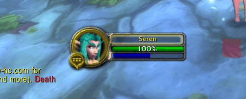

# ManaTickRule
Vanilla 1.12.1 addon for World of Warcraft that shows 5 second rule on mana tick and after 5 seconds each mana tick on player mana bar.

## Installation
1. Download **[Latest Version](https://github.com/MikeBeloborodov/ManaTickRule/archive/refs/heads/main.zip)**
2. Unpack the Zip file
3. Rename the folder "ManaTickRule-main" to "ManaTickRule"
4. Copy "ManaTickRule" into Wow-Directory\Interface\AddOns
5. Restart Wow